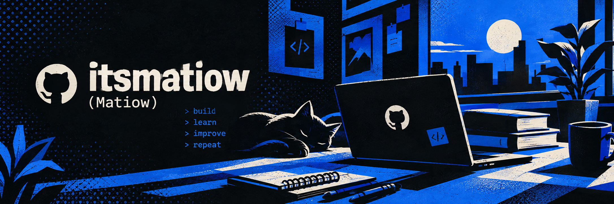

  

# Hey, I'm Matiow 👋

### Frontend Developer & UI/UX Designer

I build responsive web experiences with a focus on **React, JavaScript, and modern frontend development**.
I also design interfaces and digital products, combining development and UI/UX to turn ideas into usable experiences.

---

## 📫 Connect

- 📸 [Instagram](https://www.instagram.com/_itsmatiow)
- 💬 [Telegram](https://t.me/TheMatiow)
- 🌐 [Hashtag Team](https://hashtagteam.ir)

---

## 🛠️ Technologies

  
  
  
  
  
  
  
  

---

## 🛠️ Tech Stack

**Frontend**

React · JavaScript · HTML · CSS · Tailwind CSS · Vite · React Router

**Tools & Workflow**

Git · GitHub · Figma · REST APIs

---

## 🚀 Selected Projects

### 🏷️ Hashtag

A collaborative web project built with React, featuring a modern responsive interface and reusable UI components.

**React · JavaScript · Vite · Tailwind CSS**

[View Project](https://github.com/itsmatiow/Hashtag)

---

### 🍕 Restono

A responsive restaurant ordering experience with menu browsing, cart management, order placement, and order tracking.

**React · JavaScript · Vite · Tailwind CSS · REST API**

[View Project](https://github.com/itsmatiow/pizza-order-fa)

---

### 🗺️ SafarNegar

A travel planning web application with an interactive map for exploring and organizing travel destinations.

**React · Vite · React Leaflet · Leaflet · React Router**

[View Project](https://github.com/itsmatiow/SafarNegar)

---

### 📝 AS (Azmoon Saz)

An online exam platform built to provide a complete exam-taking experience through a responsive web interface.

**React · JavaScript · Vite · Tailwind CSS**

[View Project](https://github.com/itsmatiow/exam-platform)

---

## 🎨 UI/UX Design

Alongside frontend development, I work on **UI/UX and product design**.

Here I'll showcase selected interface designs, product concepts, and visual explorations.

### 🧥 Choob Lebasi

An online clothing rental experience, from discovering a style to booking the perfect outfit

  

---

### 🕌 Ahl-e Behesht

A shared space for Quran recitation and Salawat, built around collective participation

  

---

### 🎬 Dast Be Naqd

A community-driven space to discover, watch, and review movies and TV shows

  
  

---

### 🍱 Cook Pack

Ingredient ordering based on your chosen recipe

  
  
  

---

### ✍️ Ghalam

An interactive space for writing, continuing, and creating stories together

  
  

---

## 📊 GitHub Stats

  
  

---

## 💡 What I Like Building

* Responsive web interfaces
* Interactive user experiences
* React applications
* Product and interface design
* Projects that combine design and development

---

## 📫 Let's Connect

[GitHub](https://github.com/itsmatiow)

---

# سلام، من Matiow هستم 👋

### توسعه‌دهنده فرانت‌اند و طراح UI/UX

روی ساخت تجربه‌های وب واکنش‌گرا با تمرکز بر **React، JavaScript و توسعه مدرن فرانت‌اند** کار می‌کنم.
در کنار توسعه، روی طراحی رابط و محصولات دیجیتال هم کار می‌کنم و علاقه‌مندم طراحی و توسعه را برای ساخت تجربه‌های کاربردی در کنار هم قرار بدهم.

---

## 📫 ارتباط با من

* 📸 [اینستاگرام](https://www.instagram.com/_itsmatiow)
* 💬 [تلگرام](https://t.me/TheMatiow)
* 🌐 [تیم هشتگ](https://hashtagteam.ir)

---

## 🛠️ تکنولوژی‌ها

  
  
  
  
  
  
  
  

---

## 🛠️ مهارت‌ها و ابزارها

**فرانت‌اند**

React · JavaScript · HTML · CSS · Tailwind CSS · Vite · React Router

**ابزارها و روند کاری**

Git · GitHub · Figma · REST API

---

## 🚀 پروژه‌های منتخب

### 🏷️ هشتگ

یک پروژه وب تیمی ساخته‌شده با React، با تمرکز بر رابط کاربری مدرن، واکنش‌گرا و استفاده از کامپوننت‌های قابل استفاده مجدد.

**React · JavaScript · Vite · Tailwind CSS**

[مشاهده پروژه](https://github.com/itsmatiow/Hashtag)

---

### 🍕 رستونو

یک تجربه سفارش آنلاین رستوران شامل مشاهده منو، مدیریت سبد خرید، ثبت سفارش و پیگیری سفارش.

**React · JavaScript · Vite · Tailwind CSS · REST API**

[مشاهده پروژه](https://github.com/itsmatiow/pizza-order-fa)

---

### 🗺️ سفرنگار

یک وب‌اپلیکیشن برنامه‌ریزی سفر با نقشه تعاملی برای جست‌وجو و مدیریت مقصدهای سفر.

**React · Vite · React Leaflet · Leaflet · React Router**

[مشاهده پروژه](https://github.com/itsmatiow/SafarNegar)

---

### 📝 آس (آزمون ساز)

یک پلتفرم آزمون آنلاین با هدف ارائه یک تجربه کامل و واکنش‌گرا برای شرکت در آزمون‌ها.

**React · JavaScript · Vite · Tailwind CSS**

[مشاهده پروژه](https://github.com/itsmatiow/exam-platform)

---

## 🎨 طراحی UI/UX

در کنار توسعه فرانت‌اند، روی **طراحی UI/UX و طراحی محصول** هم کار می‌کنم.

در این بخش، تعدادی از طراحی‌های رابط کاربری، ایده‌های محصول و تجربه‌های بصری من را می‌بینید.

### 🧥 چوب‌لباسی

بازار آنلاین اجاره لباس؛ از انتخاب استایل تا رزرو لباس موردنظر

  

---

### 🕌 اهل بهشت

فضایی برای مشارکت جمعی در ختم قرآن و صلوات و ثبت میزان مشارکت

  

---

### 🎬 دست‌به‌نقد

جایی برای کشف، تماشا و نقد فیلم و سریال با مشارکت کاربران

  
  

---

### 🍱 کوک‌پک

از انتخاب غذا تا رسیدن مواد اولیه؛ باکس آماده آشپزی متناسب با تعداد نفرات و تاریخ دلخواه

  
  
  

---

### ✍️ قلم

فضایی تعاملی برای نوشتن، ادامه‌دادن و ساختن داستان با دیگران

  
  

---

## 📊 آمار گیت‌هاب

  
  

---

## 💡 چیزهایی که دوست دارم بسازم

* رابط‌های وب واکنش‌گرا
* تجربه‌های تعاملی و کاربردی
* اپلیکیشن‌های React
* طراحی محصول و رابط کاربری
* پروژه‌هایی که طراحی و توسعه را با هم ترکیب می‌کنند

---

## 📫 ارتباط با من

[GitHub](https://github.com/itsmatiow)
